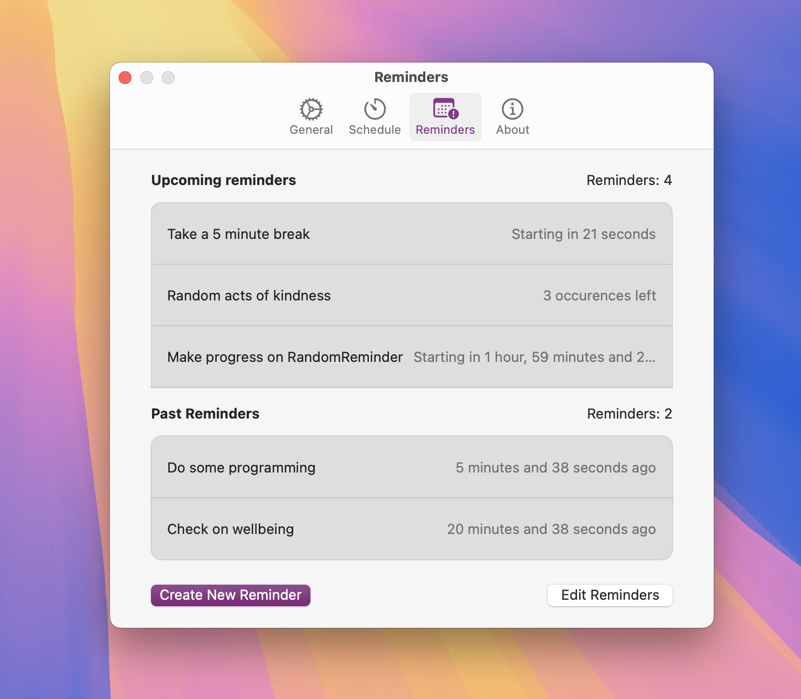
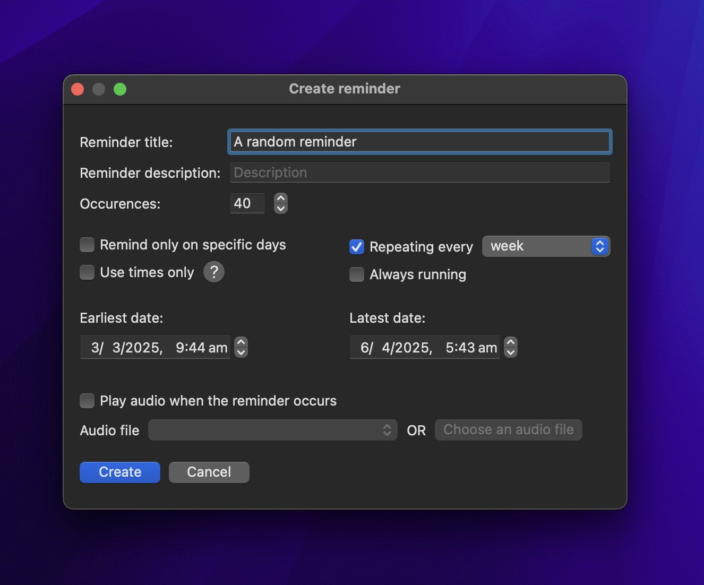

# RandomReminder

A macOS menu bar app built with SwiftUI that randonly reminds you to do things. 
It is a non-generic take on a reminders app that is spontaneous in naature and highly customisable.

## Screenshots

## Features in development
- [x] A proper settings panel with icons
- [x] Model serialisation via JSON and `AppStorage` for application preferences
- [x] A view for creating reminders
- [x] A view for editing existing reminders
- [x] Reminder deletion
- [x] Display reminders in preferences
- [ ] Configuration of notifications and a window to guide the user to select the appropriate options
- [x] An option for launching the application at login
- [ ] Default preferences for dates/times selected
- [ ] SwiftLint for in-editor linting
- [ ] SwiftFormat for code formatting
- [ ] Pre-commit hooks for SwiftFormat
- [ ] Non UI testing, potentially via Docker
- [ ] Xcode build testing
- [ ] `CONTRIBUTING.md` post-release
- [ ] GitHub actions
- [x] SwiftGen for strongly typed localisations
- [ ] English (American), English (Australian) and Italian localisations
- [ ] App and menu bar icons
- [ ] A interactive, high fidelity Figma prototype

> [!WARNING]
> RandomReminder is incomplete in its functionality and documentation and is still being developed. Features—especially UI designs—are subject to change.
